# [📈 Live Status](https://KazuoID.github.io/upptime-v2): <!--live status--> **🟧 Partial outage**

This repository contains the open-source uptime monitor and status page for [KazuoID](adit.h4ck.me), powered by [Upptime](https://github.com/upptime/upptime).

With [Upptime](https://upptime.js.org), you can get your own unlimited and free uptime monitor and status page, powered entirely by a GitHub repository. We use [Issues](https://github.com/KazuoID/upptime-v2/issues) as incident reports, [Actions](https://github.com/KazuoID/upptime-v2/actions) as uptime monitors, and [Pages](https://KazuoID.github.io/upptime-v2) for the status page.

<!--start: status pages-->
<!-- This summary is generated by Upptime (https://github.com/upptime/upptime) -->
<!-- Do not edit this manually, your changes will be overwritten -->
<!-- prettier-ignore -->
| URL | Status | History | Response Time | Uptime |
| --- | ------ | ------- | ------------- | ------ |
|  [v1](https://www.adrianmh.my.id) | 🟩 Up | [v1.yml](https://github.com/KazuoID/upptime-v2/commits/HEAD/history/v1.yml) | 

 427ms
     
 | 

<a href="https://KazuoID.github.io/upptime-v2/history/v1">100.00%</a>
    

|  [v2](https://www.alfeus.my.id) | 🟩 Up | [v2.yml](https://github.com/KazuoID/upptime-v2/commits/HEAD/history/v2.yml) | 

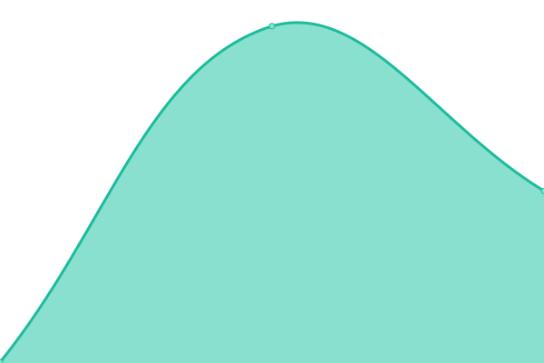 351ms
     
 | 

<a href="https://KazuoID.github.io/upptime-v2/history/v2">100.00%</a>
    

|  [v3](https://www.angelarp.my.id) | 🟩 Up | [v3.yml](https://github.com/KazuoID/upptime-v2/commits/HEAD/history/v3.yml) | 

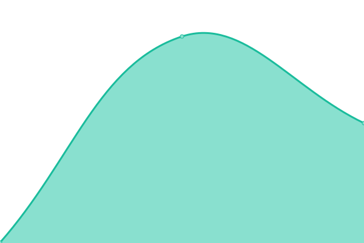 403ms
     
 | 

<a href="https://KazuoID.github.io/upptime-v2/history/v3">100.00%</a>
    

|  [v4](https://www.angellll.my.id) | 🟩 Up | [v4.yml](https://github.com/KazuoID/upptime-v2/commits/HEAD/history/v4.yml) | 

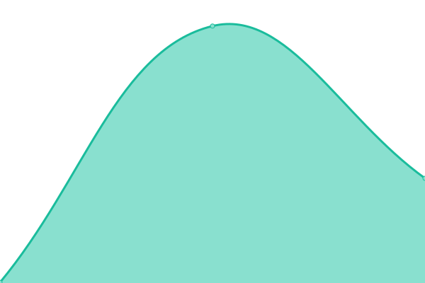 320ms
     
 | 

<a href="https://KazuoID.github.io/upptime-v2/history/v4">100.00%</a>
    

|  [v5](https://www.christianfelix.my.id) | 🟩 Up | [v5.yml](https://github.com/KazuoID/upptime-v2/commits/HEAD/history/v5.yml) | 

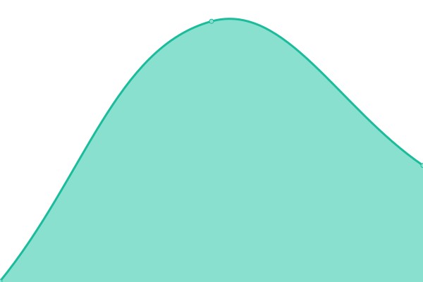 301ms
     
 | 

<a href="https://KazuoID.github.io/upptime-v2/history/v5">100.00%</a>
    

|  [v6](https://www.davin.my.id) | 🟩 Up | [v6.yml](https://github.com/KazuoID/upptime-v2/commits/HEAD/history/v6.yml) | 

 393ms
     
 | 

<a href="https://KazuoID.github.io/upptime-v2/history/v6">100.00%</a>
    

|  [v7](https://www.elia3.my.id) | 🟩 Up | [v7.yml](https://github.com/KazuoID/upptime-v2/commits/HEAD/history/v7.yml) | 

 289ms
     
 | 

<a href="https://KazuoID.github.io/upptime-v2/history/v7">100.00%</a>
    

|  [v8](https://www.fidelisalledeo.my.id) | 🟩 Up | [v8.yml](https://github.com/KazuoID/upptime-v2/commits/HEAD/history/v8.yml) | 

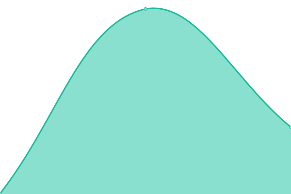 325ms
     
 | 

<a href="https://KazuoID.github.io/upptime-v2/history/v8">100.00%</a>
    

|  [v9](https://www.filemon.my.id) | 🟩 Up | [v9.yml](https://github.com/KazuoID/upptime-v2/commits/HEAD/history/v9.yml) | 

 520ms
     
 | 

<a href="https://KazuoID.github.io/upptime-v2/history/v9">100.00%</a>
    

|  [v10](https://www.patricio1.my.id) | 🟩 Up | [v10.yml](https://github.com/KazuoID/upptime-v2/commits/HEAD/history/v10.yml) | 

 384ms
     
 | 

<a href="https://KazuoID.github.io/upptime-v2/history/v10">100.00%</a>
    

|  [v11](https://www.hubertushugo.my.id) | 🟩 Up | [v11.yml](https://github.com/KazuoID/upptime-v2/commits/HEAD/history/v11.yml) | 

 389ms
     
 | 

<a href="https://KazuoID.github.io/upptime-v2/history/v11">100.00%</a>
    

|  [v12](https://www.imanuel.my.id) | 🟥 Down | [v12.yml](https://github.com/KazuoID/upptime-v2/commits/HEAD/history/v12.yml) | 

 0ms
     
 | 

<a href="https://KazuoID.github.io/upptime-v2/history/v12">0.00%</a>
    

|  [v13](https://www.pntaaa.my.id) | 🟩 Up | [v13.yml](https://github.com/KazuoID/upptime-v2/commits/HEAD/history/v13.yml) | 

 397ms
     
 | 

<a href="https://KazuoID.github.io/upptime-v2/history/v13">100.00%</a>
    

|  [v14](https://www.jasminedaniela.my.id) | 🟩 Up | [v14.yml](https://github.com/KazuoID/upptime-v2/commits/HEAD/history/v14.yml) | 

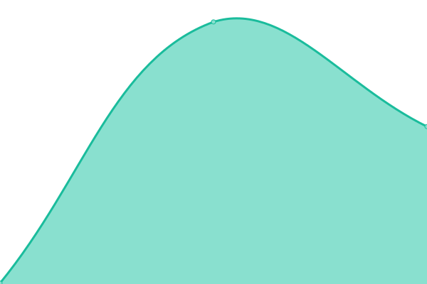 259ms
     
 | 

<a href="https://KazuoID.github.io/upptime-v2/history/v14">100.00%</a>
    

|  [v15](https://www.jojoandros.my.id) | 🟩 Up | [v15.yml](https://github.com/KazuoID/upptime-v2/commits/HEAD/history/v15.yml) | 

 348ms
     
 | 

<a href="https://KazuoID.github.io/upptime-v2/history/v15">100.00%</a>
    

|  [v16](https://www.nathan18.my.id) | 🟩 Up | [v16.yml](https://github.com/KazuoID/upptime-v2/commits/HEAD/history/v16.yml) | 

 459ms
     
 | 

<a href="https://KazuoID.github.io/upptime-v2/history/v16">100.00%</a>
    

|  [v17](https://www.jovianalexa.my.id) | 🟩 Up | [v17.yml](https://github.com/KazuoID/upptime-v2/commits/HEAD/history/v17.yml) | 

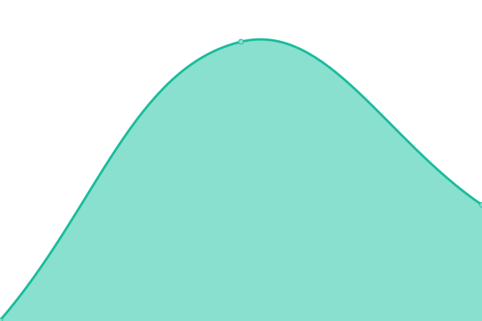 370ms
     
 | 

<a href="https://KazuoID.github.io/upptime-v2/history/v17">100.00%</a>
    

|  [v18](https://www.krismenda.my.id) | 🟩 Up | [v18.yml](https://github.com/KazuoID/upptime-v2/commits/HEAD/history/v18.yml) | 

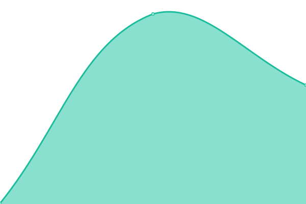 265ms
     
 | 

<a href="https://KazuoID.github.io/upptime-v2/history/v18">100.00%</a>
    

|  [v19](https://www.leonjoseph17.my.id) | 🟥 Down | [v19.yml](https://github.com/KazuoID/upptime-v2/commits/HEAD/history/v19.yml) | 

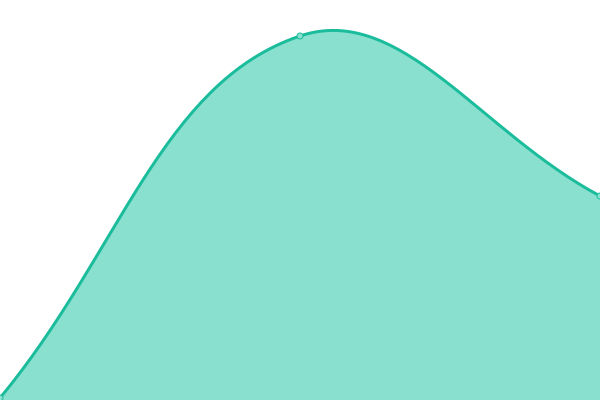 142ms
     
 | 

<a href="https://KazuoID.github.io/upptime-v2/history/v19">0.00%</a>
    

|  [v20](https://www.luckymarvel1.my.id) | 🟩 Up | [v20.yml](https://github.com/KazuoID/upptime-v2/commits/HEAD/history/v20.yml) | 

 510ms
     
 | 

<a href="https://KazuoID.github.io/upptime-v2/history/v20">100.00%</a>
    

|  [v21](https://www.ryuxyro.my.id) | 🟩 Up | [v21.yml](https://github.com/KazuoID/upptime-v2/commits/HEAD/history/v21.yml) | 

 411ms
     
 | 

<a href="https://KazuoID.github.io/upptime-v2/history/v21">100.00%</a>
    

|  [v22](https://www.maxfrederick.my.id) | 🟩 Up | [v22.yml](https://github.com/KazuoID/upptime-v2/commits/HEAD/history/v22.yml) | 

 269ms
     
 | 

<a href="https://KazuoID.github.io/upptime-v2/history/v22">100.00%</a>
    

|  [v23](https://www.michaeladrimiwa.my.id) | 🟩 Up | [v23.yml](https://github.com/KazuoID/upptime-v2/commits/HEAD/history/v23.yml) | 

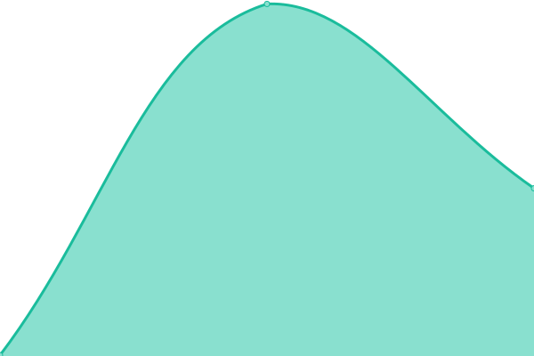 329ms
     
 | 

<a href="https://KazuoID.github.io/upptime-v2/history/v23">100.00%</a>
    

|  [v24 (not found)](https://) | 🟥 Down | [v24-not-found.yml](https://github.com/KazuoID/upptime-v2/commits/HEAD/history/v24-not-found.yml) | 

 157ms
     
 | 

<a href="https://KazuoID.github.io/upptime-v2/history/v24-not-found">93.35%</a>
    

|  [v25](https://www.putraalikramsadewa.my.id) | 🟩 Up | [v25.yml](https://github.com/KazuoID/upptime-v2/commits/HEAD/history/v25.yml) | 

 283ms
     
 | 

<a href="https://KazuoID.github.io/upptime-v2/history/v25">100.00%</a>
    

|  [v26](https://www.revaldo.my.id) | 🟩 Up | [v26.yml](https://github.com/KazuoID/upptime-v2/commits/HEAD/history/v26.yml) | 

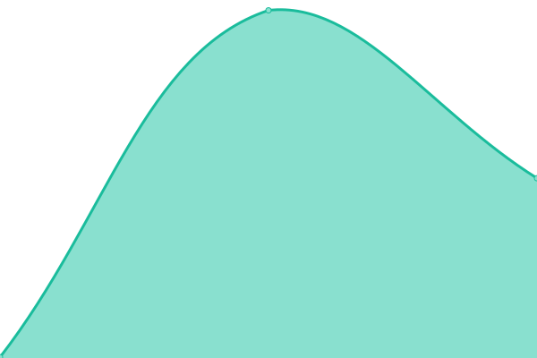 332ms
     
 | 

<a href="https://KazuoID.github.io/upptime-v2/history/v26">100.00%</a>
    

|  [v27](https://www.reyhanhrtnt.my.id) | 🟩 Up | [v27.yml](https://github.com/KazuoID/upptime-v2/commits/HEAD/history/v27.yml) | 

 458ms
     
 | 

<a href="https://KazuoID.github.io/upptime-v2/history/v27">100.00%</a>
    

|  [v28](https://www.rizkydashboard11.my.id) | 🟩 Up | [v28.yml](https://github.com/KazuoID/upptime-v2/commits/HEAD/history/v28.yml) | 

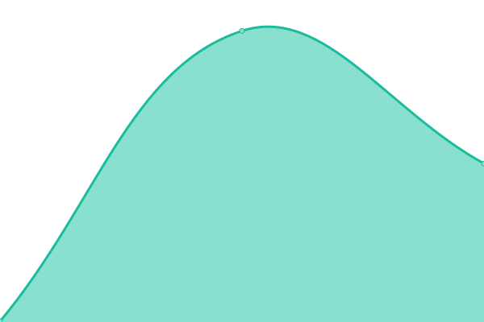 349ms
     
 | 

<a href="https://KazuoID.github.io/upptime-v2/history/v28">100.00%</a>
    

|  [v29](https://www.tessalonica.my.id) | 🟩 Up | [v29.yml](https://github.com/KazuoID/upptime-v2/commits/HEAD/history/v29.yml) | 

 445ms
     
 | 

<a href="https://KazuoID.github.io/upptime-v2/history/v29">100.00%</a>
    

|  [v30](https://www.vincensius88.my.id) | 🟩 Up | [v30.yml](https://github.com/KazuoID/upptime-v2/commits/HEAD/history/v30.yml) | 

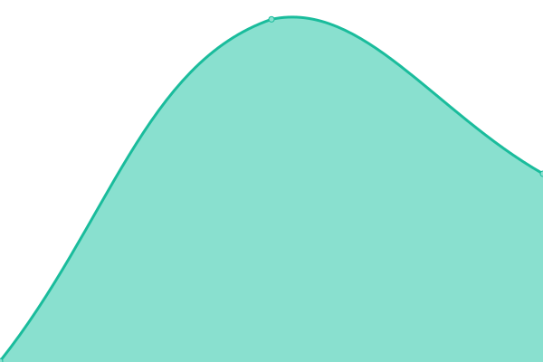 330ms
     
 | 

<a href="https://KazuoID.github.io/upptime-v2/history/v30">100.00%</a>
    

|  [v31](https://www.giovan.my.id) | 🟩 Up | [v31.yml](https://github.com/KazuoID/upptime-v2/commits/HEAD/history/v31.yml) | 

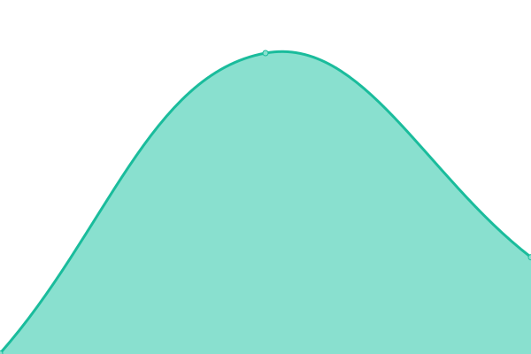 337ms
     
 | 

<a href="https://KazuoID.github.io/upptime-v2/history/v31">100.00%</a>
    

|  [v32](https://www.sjayaaa.my.id) | 🟩 Up | [v32.yml](https://github.com/KazuoID/upptime-v2/commits/HEAD/history/v32.yml) | 

 267ms
     
 | 

<a href="https://KazuoID.github.io/upptime-v2/history/v32">100.00%</a>
    

|  [v33](https://www.wisputra0202.my.id) | 🟩 Up | [v33.yml](https://github.com/KazuoID/upptime-v2/commits/HEAD/history/v33.yml) | 

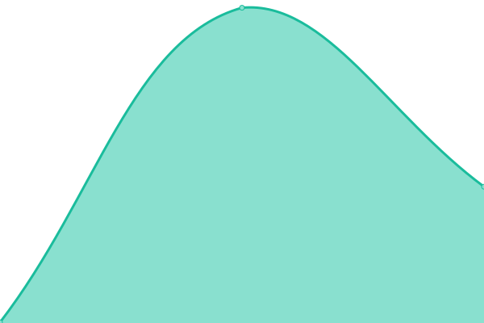 350ms
     
 | 

<a href="https://KazuoID.github.io/upptime-v2/history/v33">100.00%</a>
    

|  [v34](https://www.yohaneselkannathanael.my.id) | 🟩 Up | [v34.yml](https://github.com/KazuoID/upptime-v2/commits/HEAD/history/v34.yml) | 

 426ms
     
 | 

<a href="https://KazuoID.github.io/upptime-v2/history/v34">100.00%</a>
    

<!--end: status pages-->

[**Visit our status website →**](https://KazuoID.github.io/upptime-v2)

## 📄 License

- Powered by: [Upptime](https://github.com/upptime/upptime)
- Code: [MIT](./LICENSE) © [Anand Chowdhary](https://anandchowdhary.com), supported by [Pabio](https://pabio.com)
- Data in the `./history` directory: [Open Database License](https://opendatacommons.org/licenses/odbl/1-0/)
