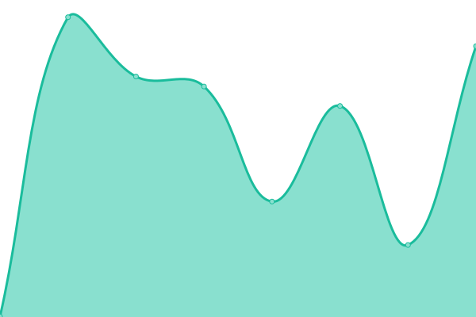
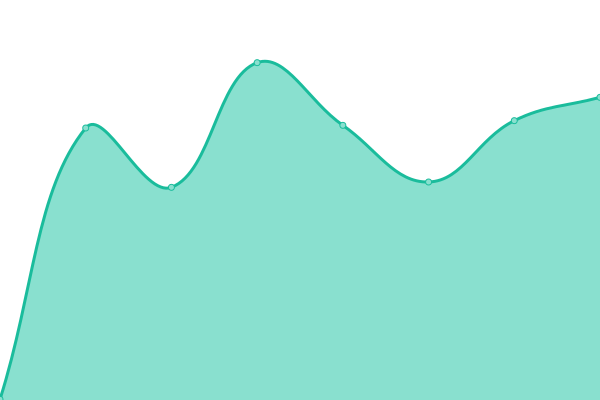
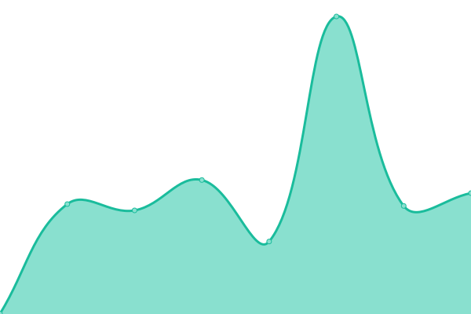
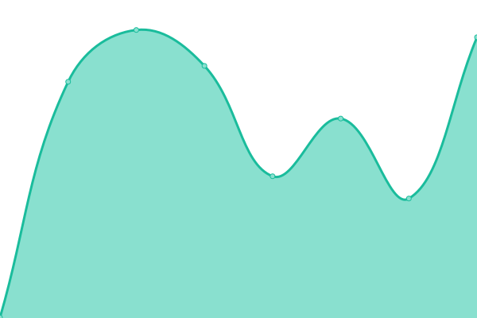
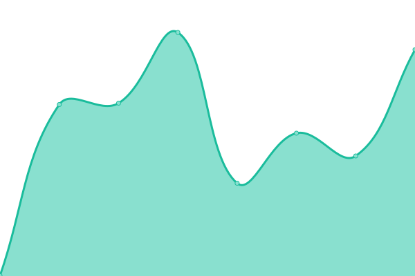
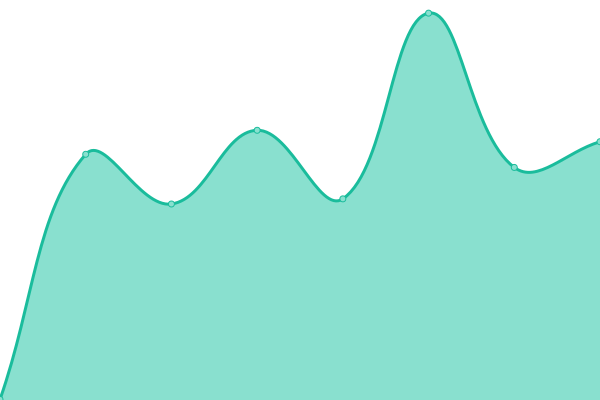
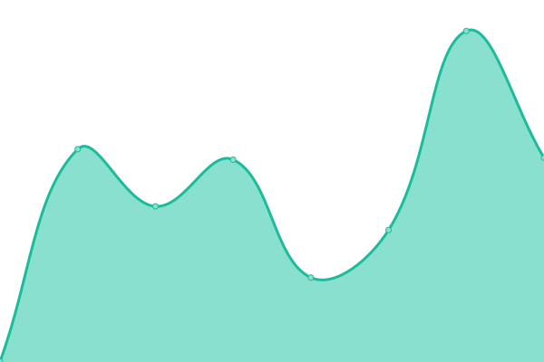
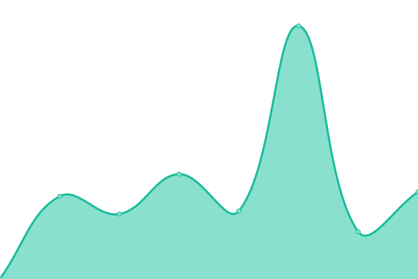

# [📈 Live Status](https://KazuoID.github.io/upptime-v2): <!--live status--> **🟧 Partial outage**

This repository contains the open-source uptime monitor and status page for [KazuoID](adit.h4ck.me), powered by [Upptime](https://github.com/upptime/upptime).

With [Upptime](https://upptime.js.org), you can get your own unlimited and free uptime monitor and status page, powered entirely by a GitHub repository. We use [Issues](https://github.com/KazuoID/upptime-v2/issues) as incident reports, [Actions](https://github.com/KazuoID/upptime-v2/actions) as uptime monitors, and [Pages](https://KazuoID.github.io/upptime-v2) for the status page.

<!--start: status pages-->
<!-- This summary is generated by Upptime (https://github.com/upptime/upptime) -->
<!-- Do not edit this manually, your changes will be overwritten -->
<!-- prettier-ignore -->
| URL | Status | History | Response Time | Uptime |
| --- | ------ | ------- | ------------- | ------ |
|  [v1 (adrian)](https://www.adrianmh.my.id) | 🟩 Up | [v1-adrian.yml](https://github.com/KazuoID/upptime-v2/commits/HEAD/history/v1-adrian.yml) | 

 457ms
     
 | 

<a href="https://KazuoID.github.io/upptime-v2/history/v1-adrian">100.00%</a>
    

|  [v2 (aal)](https://www.alfeus.my.id) | 🟩 Up | [v2-aal.yml](https://github.com/KazuoID/upptime-v2/commits/HEAD/history/v2-aal.yml) | 

 909ms
     
 | 

<a href="https://KazuoID.github.io/upptime-v2/history/v2-aal">100.00%</a>
    

|  [v3 (ardhana)](https://www.angelarp.my.id) | 🟩 Up | [v3-ardhana.yml](https://github.com/KazuoID/upptime-v2/commits/HEAD/history/v3-ardhana.yml) | 

 427ms
     
 | 

<a href="https://KazuoID.github.io/upptime-v2/history/v3-ardhana">100.00%</a>
    

|  [v4 (angelina)](https://www.angellll.my.id) | 🟩 Up | [v4-angelina.yml](https://github.com/KazuoID/upptime-v2/commits/HEAD/history/v4-angelina.yml) | 

 506ms
     
 | 

<a href="https://KazuoID.github.io/upptime-v2/history/v4-angelina">100.00%</a>
    

|  [v5 (felix)](https://www.christianfelix.my.id) | 🟩 Up | [v5-felix.yml](https://github.com/KazuoID/upptime-v2/commits/HEAD/history/v5-felix.yml) | 

 405ms
     
 | 

<a href="https://KazuoID.github.io/upptime-v2/history/v5-felix">100.00%</a>
    

|  [v6 (davin)](https://www.davin.my.id) | 🟩 Up | [v6-davin.yml](https://github.com/KazuoID/upptime-v2/commits/HEAD/history/v6-davin.yml) | 

 440ms
     
 | 

<a href="https://KazuoID.github.io/upptime-v2/history/v6-davin">100.00%</a>
    

|  [v7 (elia)](https://www.elia3.my.id) | 🟩 Up | [v7-elia.yml](https://github.com/KazuoID/upptime-v2/commits/HEAD/history/v7-elia.yml) | 

 697ms
     
 | 

<a href="https://KazuoID.github.io/upptime-v2/history/v7-elia">100.00%</a>
    

|  [v8 (fidelis)](https://www.fidelisalledeo.my.id) | 🟥 Down | [v8-fidelis.yml](https://github.com/KazuoID/upptime-v2/commits/HEAD/history/v8-fidelis.yml) | 

 0ms
     
 | 

<a href="https://KazuoID.github.io/upptime-v2/history/v8-fidelis">0.00%</a>
    

|  [v9 (filemon)](https://www.filemon.my.id) | 🟩 Up | [v9-filemon.yml](https://github.com/KazuoID/upptime-v2/commits/HEAD/history/v9-filemon.yml) | 

 411ms
     
 | 

<a href="https://KazuoID.github.io/upptime-v2/history/v9-filemon">100.00%</a>
    

|  [v10 (gabriel)](https://www.patricio1.my.id) | 🟩 Up | [v10-gabriel.yml](https://github.com/KazuoID/upptime-v2/commits/HEAD/history/v10-gabriel.yml) | 

 426ms
     
 | 

<a href="https://KazuoID.github.io/upptime-v2/history/v10-gabriel">100.00%</a>
    

|  [v11 (hugo)](https://www.hubertushugo.my.id) | 🟩 Up | [v11-hugo.yml](https://github.com/KazuoID/upptime-v2/commits/HEAD/history/v11-hugo.yml) | 

 420ms
     
 | 

<a href="https://KazuoID.github.io/upptime-v2/history/v11-hugo">100.00%</a>
    

|  [v12 (imanuel)](https://www.imanuel.my.id) | 🟩 Up | [v12-imanuel.yml](https://github.com/KazuoID/upptime-v2/commits/HEAD/history/v12-imanuel.yml) | 

 319ms
     
 | 

<a href="https://KazuoID.github.io/upptime-v2/history/v12-imanuel">100.00%</a>
    

|  [v13 (sandy)](https://www.pntaaa.my.id) | 🟩 Up | [v13-sandy.yml](https://github.com/KazuoID/upptime-v2/commits/HEAD/history/v13-sandy.yml) | 

 383ms
     
 | 

<a href="https://KazuoID.github.io/upptime-v2/history/v13-sandy">100.00%</a>
    

|  [v14 (jasmine)](https://www.jasminedaniela.my.id) | 🟩 Up | [v14-jasmine.yml](https://github.com/KazuoID/upptime-v2/commits/HEAD/history/v14-jasmine.yml) | 

 400ms
     
 | 

<a href="https://KazuoID.github.io/upptime-v2/history/v14-jasmine">100.00%</a>
    

|  [v15 (jojo)](https://www.jojoandros.my.id) | 🟩 Up | [v15-jojo.yml](https://github.com/KazuoID/upptime-v2/commits/HEAD/history/v15-jojo.yml) | 

 409ms
     
 | 

<a href="https://KazuoID.github.io/upptime-v2/history/v15-jojo">100.00%</a>
    

|  [v16 (nathan)](https://www.nathan18.my.id) | 🟥 Down | [v16-nathan.yml](https://github.com/KazuoID/upptime-v2/commits/HEAD/history/v16-nathan.yml) | 

 0ms
     
 | 

<a href="https://KazuoID.github.io/upptime-v2/history/v16-nathan">0.00%</a>
    

|  [v17 (jovian)](https://www.jovianalexa.my.id) | 🟥 Down | [v17-jovian.yml](https://github.com/KazuoID/upptime-v2/commits/HEAD/history/v17-jovian.yml) | 

 0ms
     
 | 

<a href="https://KazuoID.github.io/upptime-v2/history/v17-jovian">0.00%</a>
    

|  [v18 (krismenda)](https://www.krismenda.my.id) | 🟩 Up | [v18-krismenda.yml](https://github.com/KazuoID/upptime-v2/commits/HEAD/history/v18-krismenda.yml) | 

 409ms
     
 | 

<a href="https://KazuoID.github.io/upptime-v2/history/v18-krismenda">100.00%</a>
    

|  [v19 (leon)](https://www.leonjoseph17.my.id) | 🟥 Down | [v19-leon.yml](https://github.com/KazuoID/upptime-v2/commits/HEAD/history/v19-leon.yml) | 

 0ms
     
 | 

<a href="https://KazuoID.github.io/upptime-v2/history/v19-leon">0.00%</a>
    

|  [v20 (lucky)](https://www.luckymarvel1.my.id) | 🟩 Up | [v20-lucky.yml](https://github.com/KazuoID/upptime-v2/commits/HEAD/history/v20-lucky.yml) | 

 437ms
     
 | 

<a href="https://KazuoID.github.io/upptime-v2/history/v20-lucky">100.00%</a>
    

|  [v21 (adit / rizqi)](https://www.ryuxyro.my.id) | 🟩 Up | [v21-adit-rizqi.yml](https://github.com/KazuoID/upptime-v2/commits/HEAD/history/v21-adit-rizqi.yml) | 

 541ms
     
 | 

<a href="https://KazuoID.github.io/upptime-v2/history/v21-adit-rizqi">100.00%</a>
    

|  [v22 (max)](https://www.maxfrederick.my.id) | 🟩 Up | [v22-max.yml](https://github.com/KazuoID/upptime-v2/commits/HEAD/history/v22-max.yml) | 

 377ms
     
 | 

<a href="https://KazuoID.github.io/upptime-v2/history/v22-max">100.00%</a>
    

|  [v23 (michael)](https://www.michaeladrimiwa.my.id) | 🟩 Up | [v23-michael.yml](https://github.com/KazuoID/upptime-v2/commits/HEAD/history/v23-michael.yml) | 

 429ms
     
 | 

<a href="https://KazuoID.github.io/upptime-v2/history/v23-michael">100.00%</a>
    

|  [v24 (not found)](https://) | 🟥 Down | [v24-not-found.yml](https://github.com/KazuoID/upptime-v2/commits/HEAD/history/v24-not-found.yml) | 

 0ms
     
 | 

<a href="https://KazuoID.github.io/upptime-v2/history/v24-not-found">0.00%</a>
    

|  [v25 (dewa)](https://www.putraalikramsadewa.my.id) | 🟩 Up | [v25-dewa.yml](https://github.com/KazuoID/upptime-v2/commits/HEAD/history/v25-dewa.yml) | 

 380ms
     
 | 

<a href="https://KazuoID.github.io/upptime-v2/history/v25-dewa">100.00%</a>
    

|  [v26 (aldo)](https://www.revaldo.my.id) | 🟩 Up | [v26-aldo.yml](https://github.com/KazuoID/upptime-v2/commits/HEAD/history/v26-aldo.yml) | 

 370ms
     
 | 

<a href="https://KazuoID.github.io/upptime-v2/history/v26-aldo">100.00%</a>
    

|  [v27 (reyhan)](https://www.reyhanhrtnt.my.id) | 🟩 Up | [v27-reyhan.yml](https://github.com/KazuoID/upptime-v2/commits/HEAD/history/v27-reyhan.yml) | 

 1067ms
     
 | 

<a href="https://KazuoID.github.io/upptime-v2/history/v27-reyhan">100.00%</a>
    

|  [v28 (rizky)](https://www.rizkydashboard11.my.id) | 🟩 Up | [v28-rizky.yml](https://github.com/KazuoID/upptime-v2/commits/HEAD/history/v28-rizky.yml) | 

 427ms
     
 | 

<a href="https://KazuoID.github.io/upptime-v2/history/v28-rizky">100.00%</a>
    

|  [v29 (tessa)](https://www.tessalonica.my.id) | 🟩 Up | [v29-tessa.yml](https://github.com/KazuoID/upptime-v2/commits/HEAD/history/v29-tessa.yml) | 

 414ms
     
 | 

<a href="https://KazuoID.github.io/upptime-v2/history/v29-tessa">100.00%</a>
    

|  [v30 (vincen)](https://www.vincensius88.my.id) | 🟥 Down | [v30-vincen.yml](https://github.com/KazuoID/upptime-v2/commits/HEAD/history/v30-vincen.yml) | 

 0ms
     
 | 

<a href="https://KazuoID.github.io/upptime-v2/history/v30-vincen">0.00%</a>
    

|  [v31 (gio)](https://www.giovan.my.id) | 🟩 Up | [v31-gio.yml](https://github.com/KazuoID/upptime-v2/commits/HEAD/history/v31-gio.yml) | 

 426ms
     
 | 

<a href="https://KazuoID.github.io/upptime-v2/history/v31-gio">100.00%</a>
    

|  [v32 (widi)](https://www.sjayaaa.my.id) | 🟩 Up | [v32-widi.yml](https://github.com/KazuoID/upptime-v2/commits/HEAD/history/v32-widi.yml) | 

 439ms
     
 | 

<a href="https://KazuoID.github.io/upptime-v2/history/v32-widi">100.00%</a>
    

|  [v33 (wisnu)](https://www.wisputra0202.my.id) | 🟩 Up | [v33-wisnu.yml](https://github.com/KazuoID/upptime-v2/commits/HEAD/history/v33-wisnu.yml) | 

 455ms
     
 | 

<a href="https://KazuoID.github.io/upptime-v2/history/v33-wisnu">100.00%</a>
    

|  [v34 (elkan)](https://www.yohaneselkannathanael.my.id) | 🟩 Up | [v34-elkan.yml](https://github.com/KazuoID/upptime-v2/commits/HEAD/history/v34-elkan.yml) | 

 405ms
     
 | 

<a href="https://KazuoID.github.io/upptime-v2/history/v34-elkan">100.00%</a>
    

<!--end: status pages-->

[**Visit our status website →**](https://KazuoID.github.io/upptime-v2)

## 📄 License

- Powered by: [Upptime](https://github.com/upptime/upptime)
- Code: [MIT](./LICENSE) © [Anand Chowdhary](https://anandchowdhary.com), supported by [Pabio](https://pabio.com)
- Data in the `./history` directory: [Open Database License](https://opendatacommons.org/licenses/odbl/1-0/)
